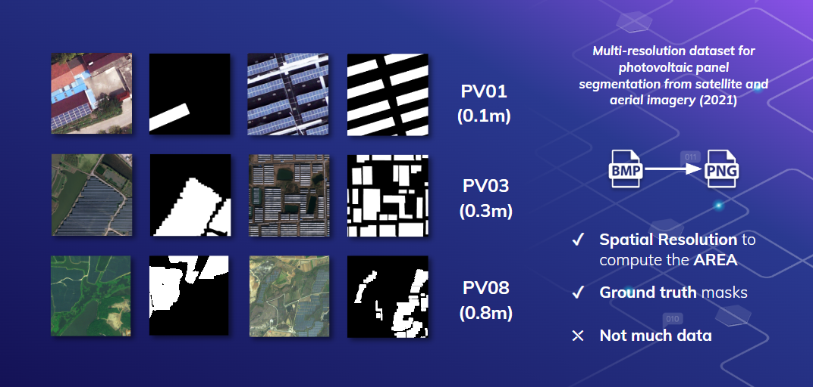
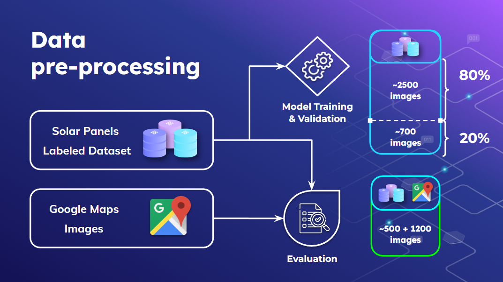
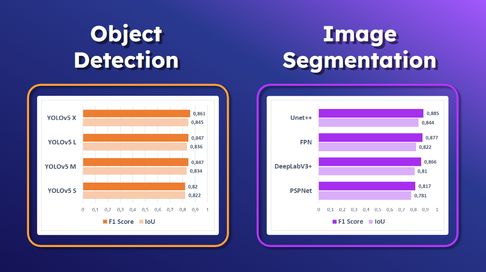
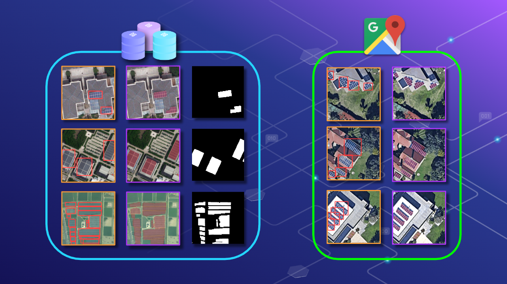

# Deep-Learning-for-Solar-Panel-Recognition

Recognition of photovoltaic cells in aerial images with **Convolutional Neural Networks** (CNNs).
**Object detection** with YOLOv5 models and **image segmentation** with Unet++, FPN, DLV3+ and PSPNet.


## 💽 Installation + pytorch CUDA 11.3

-----------
With **pip**:
```
pip3 install -r requirements.txt && pip3 install torch torchvision --extra-index-url https://download.pytorch.org/whl/cu113
```
With **Anaconda**:
```
pip3 install -r requirements.txt && conda install pytorch torchvision torchaudio cudatoolkit=11.3 -c pytorch
```

## 🔍 Data gathering

-----------
* ### ☀ Solar Panels Dataset
    _Multi-resolution dataset for photovoltaic panel segmentation from satellite and aerial imagery_ (https://zenodo.org/record/5171712)
  
* ### 🌍 Google Maps Aerial Images
  * **GoogleMapsAPI:** ``src/data/wrappers.GoogleMapsAPIDownloader``
  * **Web Scraping:** ``src/data/wrappers.GoogleMapsWebDownloader``
  
* ### 📡 Sentinel-2 Data (unused)
  Sentinel-2 Satellite data from Copernicus. ``src/data/wrappers.Sentinel2Downloader``

## 🛠 Processing pipeline

------------


## 🧪 Models

-----------
* ### Object Detection
  * **YOLOv5-S:** 7.2 M parameters
  * **YOLOv5-M:** 21.2 M parameters
  * **YOLOv5-L:** 46.5 M parameters
  * **YOLOv5-X:** 86.7 M parameters

  Architectures are based on [YOLOv5](https://github.com/ultralytics/yolov5) repository.

* ### Image Segmentation
  * **Unet++:** ~ 20 M parameters
  * **FPN:** ~ 20 M parameters
  * **DeepLabV3+:** ~ 20 M parameters
  * **PSPNet:** ~ 20 M parameters

  Architectures are based on [segmentation_models.pytorch](https://github.com/qubvel/segmentation_models.pytorch) repository.


## 📈 Results

---------------
* ### Metrics

* ### Dataset and Google Maps images



🌐 Project Organization
------------

    ├── LICENSE
    ├── Makefile           <- Makefile with commands like `make data` or `make train`
    ├── README.md          <- The top-level README for developers using this project.
    ├── data               <- Data for the project (ommited)
    ├── docs               <- A default Sphinx project; see sphinx-doc.org for details
    │
    ├── models             <- Trained and serialized models, model predictions, or model summaries
    │
    ├── notebooks          <- Jupyter notebooks.
    │        ├── pytorch_lightning.ipynb            <- Modeling with Pytorch Ligthning.
    │        └── pytorch_sp_segmentation.ipynb      <- Modeling with vanilla Pytorch.
    │
    ├── references         <- Data dictionaries, manuals, and all other explanatory materials.
    │
    ├── reports            <- Generated analysis as HTML, PDF, LaTeX, etc.
    │        ├── figures        <- Generated graphics and figures to be used in reporting
    │        ├── Solar-Panels-Project-Report-UC3M         <- Main report
    │        └── Solar-Panels-Presentation-UC3M.pdf       <- Presentation slides for the project.
    │
    ├── requirements.txt   <- The requirements file for reproducing the analysis environment, e.g.
    │                         generated with `pip freeze > requirements.txt`
    │
    ├── setup.py           <- makes project pip installable (pip install -e .) so src can be imported
    ├── src                <- Source code for use in this project.
    │       ├── __init__.py    <- Makes src a Python module
    │       │
    │       ├── data           <- Scripts to download or generate data
    │       │       ├── download.py   <- Main scripts to download Google Maps and Sentinel-2 data. 
    │       │       ├── wrappers.py   <- Wrappers for all Google Maps and Sentinel-2.
    │       │       └── utils.py      <- Utility functions for coordinates operations.
    │       │
    │       ├── features       <- Scripts to turn raw data into features for modeling
    │       │       ├── create_yolo_annotations.py   <- Experimental script to create YOLO annotations.
    │       │       └── preprocess_data.py           <- Script to process YOLO annotations.
    │       │
    │       ├── models         <- Scripts to train models and then use trained models to make predictions
    │       │       ├── segmentation  <- Image segmentation scripts to train Unet++, FPN, DLV3+ and PSPNet models.
    │       │       └── yolo          <- Object detection scripts to train YOLO models.
    │       │
    │       └── visualization  <- Scripts to create exploratory and results oriented visualizations
    │            └── visualize.py
    │
    └── tox.ini            <- tox file with settings for running tox; see tox.readthedocs.io
--------
